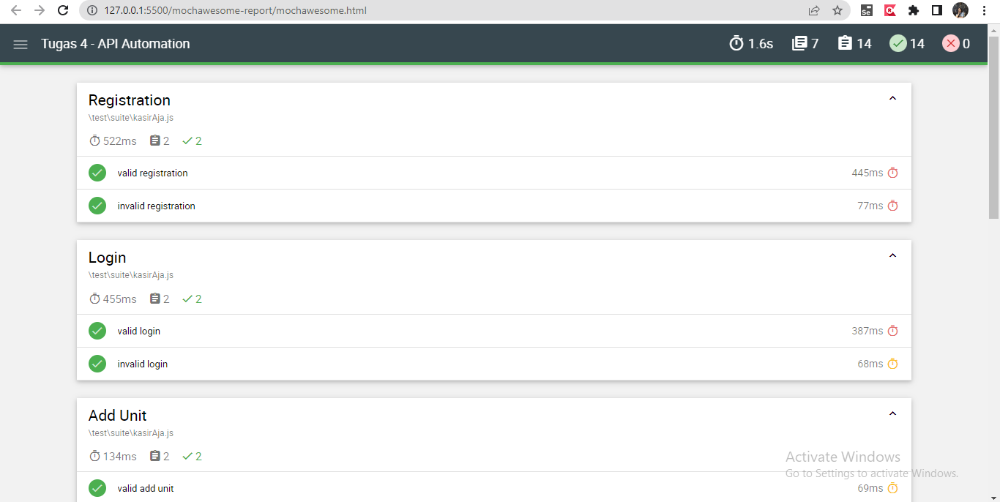

## Make API Automation using supertest, mocha and chai from this URL

https://docs.google.com/document/d/1W0XI71VrHLgnhRyziVUQqy62Acnh0FSxGHs9n4GIV_U/edit?usp=sharing  (KASIR AJA API CONTRACT/DOCUMENTATION)

## API Automation Testing Using Supertest, Mocha, and Chai

Library for Automation Test:
1. Supertest
2. Chai
3. Mocha

#### Installation and Configuration
1. Install node.js
2. Check npm version

#### Installing Package
1. `npm init`
2. `npm install mocha`
3. `npm install supertest`
4. `npm istall chai`

#### To running test cases, use the following command:
`npx mocha "/filename"`

### To create a report, run the command
`npx mocha test\spec\getUser.spec.js --reporter mochawesome`

#### Folder structure:
1. Data -> contains a collection of export data modules in the form of baseUrl, login data, registration data, and unit data
2. Test -> contains spec and suite folders. In the spec folder, there are several test scenarios (Test Scenario Register, Login, Add Unit, Get Unit Detail, Get Unit List, Update Unit, and Delete Unit) and test cases, each of which is separated into one file, and the files contained in the suite folder are a combination of several scenarios.
3. mochawesome-report -> contains the assets folder which contains the reporting test .html and .json files

#### Running all test cases

